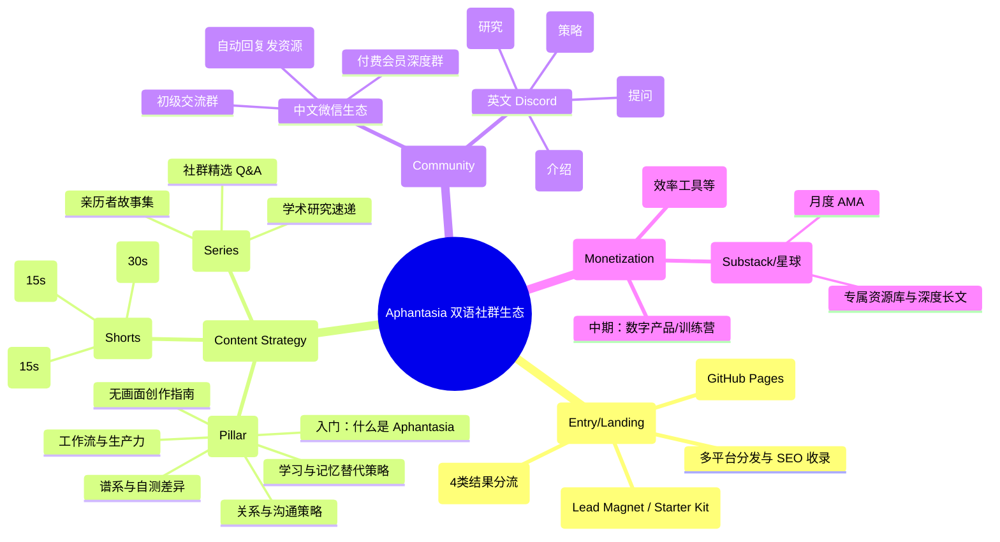
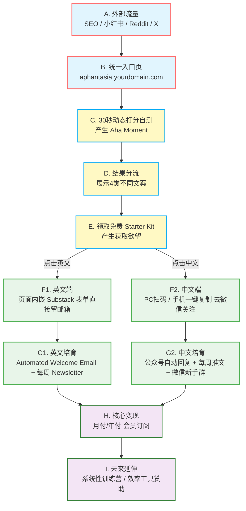

# Aphantasia 社区架构与漏斗图

## 1. 项目全局脑图 (Product Architecture)

```mermaid
mindmap
  root((Aphantasia 双语社群生态))
    流量入口 (Entry/Landing)
      多平台分发与 SEO 收录
      静态导航单页 (GitHub Pages)
      30秒顿悟自测 (4类结果分流)
      诱饵包发放 (Lead Magnet / Starter Kit)
    内容矩阵 (Content Strategy)
      支柱长文 (Pillar)
        入门：什么是 Aphantasia
        谱系与自测差异
        学习与记忆替代策略
        工作流与生产力
        无画面创作指南
        关系与沟通策略
      连载系列 (Series)
        亲历者故事集
        学术研究速递
        社群精选 Q&A
      短视频切片 (Shorts)
        误区澄清 (15s)
        自测提问 (15s)
        亲历切片 (30s)
    社群承接 (Community)
      中文微信生态
        公众号 (自动回复发资源)
        初级交流群
        付费会员深度群
      英文 Discord
        introductions (介绍)
        questions (提问)
        research-digest (研究)
        coping-strategies (策略)
    商业变现 (Monetization)
      核心：会员订阅 (Substack/星球)
        月度 AMA
        专属资源库与深度长文
      中期：数字产品/训练营
      远期：品牌合作 (效率工具等)
```

## 2. 用户旅程漏斗 (User Journey Funnel)

```mermaid
flowchart TD
  %% 定义节点
  Traffic[A. 外部流量\nSEO / 小红书 / Reddit / X]
  Landing[B. 统一入口页\naphantasia.yourdomain.com]
  SelfTest[C. 30秒动态打分自测\n产生 Aha Moment]
  Segment[D. 结果分流\n展示4类不同文案]
  LeadMagnet[E. 领取免费 Starter Kit\n产生获取欲望]
  
  %% 分流
  CaptureEN[F1. 英文端\n页面内嵌 Substack 表单直接留邮箱]
  CaptureZH[F2. 中文端\nPC扫码 / 手机一键复制 去微信关注]
  
  %% 培育
  NurtureEN[G1. 英文培育\nAutomated Welcome Email + 每周 Newsletter]
  NurtureZH[G2. 中文培育\n公众号自动回复 + 每周推文 + 微信新手群]
  
  %% 转化
  Paid[H. 核心变现\n月付/年付 会员订阅]
  Future[I. 未来延伸\n系统性训练营 / 效率工具赞助]

  %% 连接路径
  Traffic --> Landing
  Landing --> SelfTest
  SelfTest --> Segment
  Segment --> LeadMagnet
  
  LeadMagnet -->|点击英文| CaptureEN
  LeadMagnet -->|点击中文| CaptureZH
  
  CaptureEN --> NurtureEN
  CaptureZH --> NurtureZH
  
  NurtureEN --> Paid
  NurtureZH --> Paid
  
  Paid --> Future

  %% 样式
  classDef entry fill:#e1f5fe,stroke:#ff6b6b,stroke-width:2px;
  classDef hook fill:#fff9c4,stroke:#03a9f4,stroke-width:2px;
  classDef nurture fill:#e8f5e9,stroke:#4caf50,stroke-width:2px;
  classDef revenue fill:#f3e5f5,stroke:#2e7d32,stroke-width:2px;
  
  class Traffic,Landing entry;
  class SelfTest,Segment,LeadMagnet hook;
  class CaptureEN,CaptureZH,NurtureEN,NurtureZH nurture;
  class Paid,Future revenue;
```
